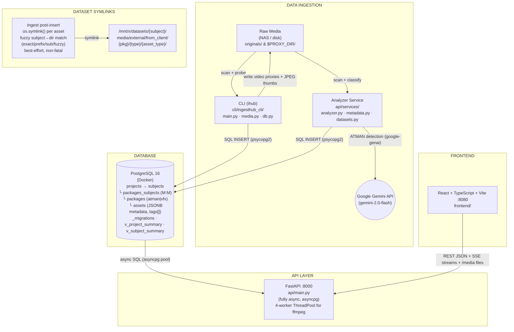

## What This Is

Media asset ingestion and management platform for VFX/ATMAN projects. Scans raw media from NAS/disk, classifies packages (ATMAN via Gemini, VFX via regex), generates proxies/thumbnails, and provides a web dashboard for browsing, searching, and managing assets across projects and subjects.

## Core Principles

- Prefer CLI tools over MCP servers when both can accomplish the task
- Prefer simple, direct solutions over complex abstractions

## Tools & Stack

- **API**: FastAPI (async, asyncpg) — `api/`
- **Frontend**: React + TypeScript + Vite + shadcn/ui + TanStack Query — `frontend/`
- **Database**: PostgreSQL 16 (Docker) — migrations in `db/migrations/`
- **CLI**: Click-based `ihub` tool — `cli/ingesthub_cli/`
- **External**: Google Gemini API (ATMAN package analysis via google-genai, gemini-2.0-flash)
- **Task runner**: mise — `mise.toml` (replaces Makefile)
- **Python**: uv for packaging, ruff for lint/format, ty for type checking — `pyproject.toml`
- **Node.js**: pnpm for packages, biome for lint/format — `frontend/biome.json`
- **Git hooks**: lefthook — `lefthook.yml` (pre-commit, pre-push, commit-msg)

## Development

```bash
cp .env.example .env          # First time setup
mise run setup                # Bootstrap everything (install tools, deps, hooks)
mise run dev                  # Start everything (DB + migrate + API :8000 + Frontend :8080)
mise run stop                 # Stop everything
mise run status               # Check what's running
```

Key mise tasks: `db`, `db:stop`, `db:logs`, `db:shell`, `migrate`, `api`, `frontend`, `test`, `test:api`, `test:fe`, `lint`, `typecheck`, `fix`, `format`

Key env vars: `DATABASE_URL`, `MEDIA_ROOT_PATHS`, `PROXY_DIR`, `DATASETS_ROOT`, `GOOGLE_API_KEY`

## Testing

- API: `mise run test:api` — pytest + pytest-asyncio + httpx
- Frontend: `mise run test:fe` — vitest + jsdom
- Both: `mise run test`

## Code Quality

- **Lint**: `mise run lint` (ruff + biome)
- **Format**: `mise run format` (ruff + biome)
- **Fix all**: `mise run fix` (auto-fix lint + format)
- **Type check**: `mise run typecheck` (ty + tsc)
- Pre-commit hooks auto-format staged files via lefthook
- Pre-push hooks run full lint + typecheck + tests

## Communication

- After implementing a plan, always provide clear instructions on how to test/verify the changes

## Project Structure

```
api/                          # FastAPI backend (async, asyncpg)
├── routers/                  # Route handlers (one per entity)
│   ├── assets.py, packages.py, projects.py, subjects.py
│   ├── ingest.py             # Ingest wizard + SSE streaming
│   ├── media.py              # File serving (proxies, thumbs)
│   ├── search.py, stats.py
├── services/                 # Business logic
│   ├── analyzer.py           # Package type detection (ATMAN/VFX)
│   ├── datasets.py           # Fuzzy dataset matching + symlinks
│   └── metadata.py           # PNG face metadata extraction
├── config.py, database.py, models.py, main.py

cli/ingesthub_cli/            # Click CLI tool (ihub)
├── main.py                   # CLI commands (scan, ingest)
├── media.py                  # ffmpeg proxy/thumbnail generation
└── db.py                     # Direct psycopg2 DB access

frontend/src/                 # React + Vite + shadcn/ui
├── pages/                    # Route entry points
├── components/
│   ├── common/               # Shared (BulkActionBar, PoseMatrix, etc.)
│   ├── layout/               # AppLayout, AppSidebar, AppBreadcrumb
│   └── ui/                   # shadcn primitives
├── hooks/                    # TanStack Query hooks per entity
├── services/                 # API client functions (fetch + SSE)
├── lib/                      # Helpers (formatters, paths, tagColors)
└── types/                    # TypeScript type declarations

db/migrations/                # SQL migrations (tracked via _migrations table)
tests/                        # pytest API tests (pytest-asyncio + httpx)
```

## Database Tables

| Table | Purpose |
|-------|---------|
| `projects` | Top-level project containers (atman/vfx type, client, tags) |
| `subjects` | People/entities within projects (dataset_dir for symlinks) |
| `packages` | Ingest delivery batches (status, package_type, picked_up flag) |
| `packages_subjects` | M:M join table (package ↔ subject) |
| `assets` | Individual media files (disk_path, proxy_path, thumbnail_path, JSONB metadata, tags[], review_status) |
| `_migrations` | Migration tracking |
| `v_project_summary` | View: project with counts and total size |
| `v_subject_summary` | View: subject with counts and total size |

## Git & Workflow

**Conventional commits:** `type(scope): description`
- Types: `feat`, `fix`, `docs`, `style`, `refactor`, `perf`, `test`, `build`, `ci`, `chore`, `revert`
- Scopes: `api`, `frontend`, `cli`, `db`

## Adding New Features

**Backend-first workflow** (do in order):

1. **Migration**: `db/migrations/00X_feature.sql`
2. **Models**: Update Pydantic models in `api/models.py`
3. **Router**: `api/routers/feature.py` — async handlers using `database.get_conn()`
4. **Register**: Add router in `api/main.py`
5. **(Optional) Service**: `api/services/feature.py` for complex business logic

**Frontend** (after backend API exists):

6. **Types**: Add interfaces to `frontend/src/types/index.ts`
7. **Service**: Add fetch functions to `frontend/src/services/feature.ts`
8. **Hook**: Add TanStack Query hook to `frontend/src/hooks/useFeature.ts`
9. **Page/Components**: `frontend/src/pages/Feature.tsx`
10. **Route**: Add to router in `App.tsx`

## Gotchas

- **Two DB drivers**: CLI uses psycopg2 (sync), API uses asyncpg (async) — don't mix them
- **ffmpeg threading**: Ingest router imports ffmpeg helpers from `cli/ingesthub_cli/media.py` and runs them in a 4-worker ThreadPoolExecutor — don't await ffmpeg directly in async handlers
- **SSE ingest streams**: `ingest/execute-stream` is a long-lived SSE connection — test with `curl`, not just the UI
- **Proxy paths are absolute**: stored as full disk paths in DB, served via `/media/{path}` with `MEDIA_ROOT_PATHS` prefix stripping
- **Dataset symlinks are best-effort**: failures don't block ingest (non-fatal)
- **`packages.subject_id`**: direct FK for primary subject, plus M:M via `packages_subjects` for multi-subject packages
- **Startup crash recovery**: API lifespan auto-marks packages stuck in `'processing'` as `'error'` on restart — re-ingest required
- **Migrations are squashed**: `001_initial_schema.sql` contains the full schema (squashed from 001–015)
- **uv, not pip**: Python deps managed via `uv sync` — never use pip directly
- **pnpm, not npm**: Frontend deps managed via `pnpm install` — never use npm directly

## Architecture Diagram Maintenance

After every plan mode implementation step, update the architecture diagram below. Use Mermaid syntax. Keep it accurate to the actual codebase, not aspirational.

## Architecture Diagram



### API Routes

| Route | Methods | Notes |
|---|---|---|
| `/api/projects` | CRUD, bulk-delete POST | |
| `/api/projects/{id}/packages` | GET | |
| `/api/projects/{id}/subjects` | GET | |
| `/api/subjects` | CRUD, bulk-delete POST | |
| `/api/subjects/{id}/packages` | GET | |
| `/api/subjects/{id}/assets` | GET | |
| `/api/packages` | PAGINATED GET, bulk-delete POST | `?package_type=&subject_id=&search=` |
| `/api/packages/{id}/summary` | GET | |
| `/api/packages/{id}/assets` | GET | |
| `/api/assets` | PAGINATED GET, bulk-update POST | `lookup-by-path` GET |
| `/api/stats/dashboard` | GET | |
| `/api/search` | GET | |
| `/api/health` | GET | |
| `/api/ingest/analyze` | POST | |
| `/api/ingest/dataset-dirs` | GET | |
| `/api/ingest/resolve-datasets` | POST | |
| `/api/ingest/execute-stream` | SSE | |
| `/media/{path}` | GET | FileResponse + cache, proxy_dir from PROXY_DIR env |

### Frontend Structure

**Pages**: Dashboard, Projects, ProjectDetail, SubjectDetail, Subjects, PackageDetail, PackageListPage (shared for atman/vfx via props: packageType, title, entityLabel)

**Hooks**: useDashboard, useProjects, useSubjects, usePackages, useAssets (usePaginatedAssets via useInfiniteQuery), useTableSelection, useDebounce, useIngest

**Components**: AddPackageDialog (6-step ingest wizard: input→preview→datasets→confirm→ingesting→done, SSE progress), VirtualizedAssetGrid (@tanstack/react-virtual), PoseMatrix (Canvas yaw×pitch heatmap for VFX), PackageSummaryCard (VFX face stats / raw stats), GlobalSearch (debounced cross-entity), BulkActionBar (entity-agnostic bulk actions), SubjectChip, SectionSummary, SourceVideoLink, PackageIndicators, CopyCommandButton, AppSidebar

**Services**: api.ts (fetch → /api proxy → :8000), ingest.ts (SSE stream), assets.ts, packages.ts, projects.ts, subjects.ts

ErrorBoundary wraps all routes. `/media` proxy → :8000 (thumbs, proxies, video).
