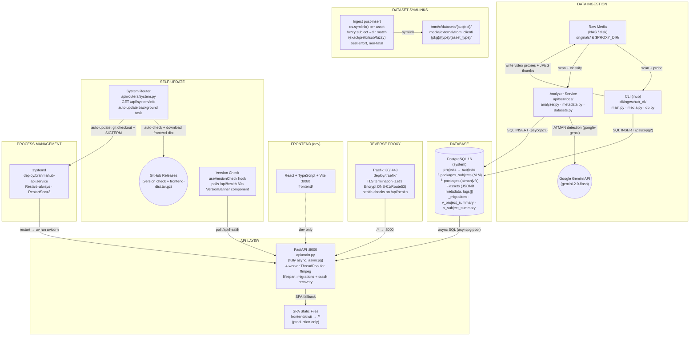

## What This Is

Media asset ingestion and management platform for VFX/ATMAN projects. Scans raw media from NAS/disk, classifies packages (ATMAN via Gemini, VFX via regex), generates proxies/thumbnails, and provides a web dashboard for browsing, searching, and managing assets across projects and subjects.

## Core Principles

- Prefer CLI tools over MCP servers when both can accomplish the task
- Prefer simple, direct solutions over complex abstractions

## Tools & Stack

- **API**: FastAPI (async, asyncpg) — `api/`
- **Frontend**: React + TypeScript + Vite + shadcn/ui + TanStack Query — `frontend/`
- **Database**: PostgreSQL 16 (system) — migrations in `db/migrations/`
- **CLI**: Click-based `ihub` tool — `cli/ingesthub_cli/`
- **External**: Google Gemini API (ATMAN package analysis via google-genai, gemini-2.0-flash)
- **Task runner**: mise — `mise.toml` (replaces Makefile)
- **Python**: uv for packaging, ruff for lint/format, ty for type checking — `pyproject.toml`
- **Node.js**: pnpm for packages, biome for lint/format — `frontend/biome.json`
- **Git hooks**: lefthook — `lefthook.yml` (pre-commit, pre-push, commit-msg)

## Development

```bash
mise trust                    # Trust mise.toml (first time only)
mise run setup                # Bootstrap: tools, deps, hooks, .env, database
mise run dev                  # Start everything (DB + migrate + API :8000 + Frontend :8080)
mise run stop                 # Stop everything
mise run status               # Check what's running
```

`mise run setup` handles everything: installs runtimes (Python, Node, pnpm, ruff, ty, lefthook), creates `.env` from `.env.example`, creates the PostgreSQL role + database, installs Python and Node deps, and sets up git hooks. Assumes PostgreSQL superuser password is `postgres` (override with `PGPASSWORD=yourpass mise run setup`).

After setup, edit `.env` to set `MEDIA_ROOT_PATHS` and `GEMINI_API_KEY`.

Key mise tasks: `db:check`, `db:shell`, `migrate`, `api`, `frontend`, `dev`, `test`, `test:api`, `test:fe`, `lint`, `typecheck`, `fix`, `format`

Key env vars: `DATABASE_URL`, `MEDIA_ROOT_PATHS`, `PROXY_DIR`, `DATASETS_ROOT`, `GEMINI_API_KEY`, `UPDATE_REPO`, `GITHUB_APP_ID`, `GITHUB_PRIVATE_KEY_PATH`, `GITHUB_INSTALLATION_ID`, `AUTO_UPDATE_INTERVAL`

## Testing

- API: `mise run test:api` — pytest + pytest-asyncio + httpx
- Frontend: `mise run test:fe` — vitest + jsdom
- Both: `mise run test`

## Code Quality

- **Lint**: `mise run lint` (ruff + biome)
- **Format**: `mise run format` (ruff + biome)
- **Fix all**: `mise run fix` (auto-fix lint + format)
- **Type check**: `mise run typecheck` (ty + tsc)
- Pre-commit hooks auto-format staged files via lefthook
- Pre-push hooks run full lint + typecheck + tests

## CI/CD

GitHub Actions workflows in `.github/workflows/`. All actions are SHA-pinned for supply chain security.

**CI** (`ci.yml` → calls `checks.yml`): runs on every PR, push to main, and merge queue
- `checks.yml` uses `dorny/paths-filter` to skip irrelevant jobs (e.g., API tests skip on frontend-only changes)
- **api-quality**: ruff lint + format check + ty type check (uv caching enabled)
- **api-test**: PostgreSQL service + migrations + pytest (uv caching enabled)
- **frontend**: biome check + tsc + vitest
- **gate**: "All checks passed" job for branch protection (handles skipped jobs correctly)
- **build** (main only): `pnpm build` smoke test, uploads artifacts

**Release** (`release.yml`): triggered on every push to main
- **release-please**: opens/updates a Release PR with version bump in `pyproject.toml`
- **update-changelog**: runs git-cliff on the Release PR branch to generate `CHANGELOG.md`
- **automerge**: enables auto-merge on the Release PR (runs after changelog to avoid race condition)
- **build-release**: on Release PR merge, builds frontend, uploads `frontend-dist.tar.gz` to the GitHub Release. Quality checks are not duplicated here — they run via CI on the PR before merge (enforced by branch protection)
- Uses GitHub App token (`vars.RELEASE_APP_ID` + `secrets.RELEASE_APP_PRIVATE_KEY`) so Release PR triggers CI
- Job-level permissions (least privilege) instead of workflow-level

**PR** (`pr.yml`): runs on every PR (opened/edited/synchronize)
- **title**: validates conventional commit format via `amannn/action-semantic-pull-request`
- **labels**: scope labels (by files changed), size labels (xs/s/m/l/xl), version impact labels (major/minor/patch/no-release)
- **dependency-review**: flags vulnerable or license-incompatible new dependencies (`fail-on-severity: high`)
- **migration-warning**: comments on PRs that include `db/migrations/` changes

**CodeQL** (`codeql.yml`): SAST scanning for Python + TypeScript
- Runs on push to main, PRs targeting main, and weekly (Monday 6 AM UTC)
- Results appear in GitHub Security tab

**Releasing**: Merge PRs with conventional commits → release-please opens Release PR → merge it → tag + GitHub Release + frontend build. No manual steps.

**CODEOWNERS**: `.github/CODEOWNERS` requires review for CI/CD pipeline changes.

## Communication

- After implementing a plan, always provide clear instructions on how to test/verify the changes

## Project Structure

```
api/                          # FastAPI backend (async, asyncpg)
├── routers/                  # Route handlers (one per entity)
│   ├── assets.py, packages.py, projects.py, subjects.py
│   ├── ingest.py             # Ingest wizard + SSE streaming
│   ├── media.py              # File serving (proxies, thumbs)
│   ├── search.py, stats.py, system.py
├── services/                 # Business logic
│   ├── analyzer.py           # Package type detection (ATMAN/VFX)
│   ├── datasets.py           # Fuzzy dataset matching + symlinks
│   ├── github_auth.py        # GitHub App JWT auth + installation token caching
│   └── metadata.py           # PNG face metadata extraction
├── config.py, database.py, models.py, main.py

cli/ingesthub_cli/            # Click CLI tool (ihub)
├── main.py                   # CLI commands (scan, ingest)
├── media.py                  # ffmpeg proxy/thumbnail generation
└── db.py                     # Direct psycopg2 DB access

frontend/src/                 # React + Vite + shadcn/ui
├── pages/                    # Route entry points
├── components/
│   ├── common/               # Shared (BulkActionBar, PoseMatrix, etc.)
│   ├── layout/               # AppLayout, AppSidebar, AppBreadcrumb
│   └── ui/                   # shadcn primitives
├── hooks/                    # TanStack Query hooks per entity
├── services/                 # API client functions (fetch + SSE)
├── lib/                      # Helpers (formatters, paths, tagColors)
└── types/                    # TypeScript type declarations

deploy/                       # Production deployment configs
├── README.md                 # Setup guide (Traefik + systemd + troubleshooting)
├── brahmahub-api.service     # systemd unit (uv run uvicorn, Restart=always)
└── traefik/                  # Traefik reverse proxy (all traefik files together)
    ├── traefik.service       # systemd unit for Traefik
    ├── traefik.yml           # Static config (entrypoints, TLS, providers)
    ├── dynamic.yml           # Dynamic config (routing, health checks)
    └── traefik.env.example   # AWS credentials + ACME email template

db/migrations/                # SQL migrations (tracked via _migrations table)
tests/                        # pytest API tests (pytest-asyncio + httpx)
```

## Database Tables

| Table | Purpose |
|-------|---------|
| `projects` | Top-level project containers (atman/vfx type, client, tags) |
| `subjects` | People/entities within projects (dataset_dir for symlinks) |
| `packages` | Ingest delivery batches (status, package_type, picked_up flag) |
| `packages_subjects` | M:M join table (package ↔ subject) |
| `assets` | Individual media files (disk_path, proxy_path, thumbnail_path, JSONB metadata, tags[], review_status) |
| `_migrations` | Migration tracking |
| `v_project_summary` | View: project with counts and total size |
| `v_subject_summary` | View: subject with counts and total size |

## Versioning

Static version in `pyproject.toml`, managed by release-please. Single source of truth: `pyproject.toml` `version` field + git tags (`v0.1.0`).

- **Python**: `importlib.metadata.version("brahmahub")` at runtime (reads from installed package metadata)
- **CLI**: `uv run ihub --version` reads from package metadata
- **API**: `/api/health` returns `{"status": "ok", "version": "..."}`, FastAPI OpenAPI schema includes version
- **Frontend**: Vite injects `VITE_APP_VERSION` at build time → displayed in sidebar
- **Releasing**: Automated via release-please. Merge PRs → Release PR opens → merge it → tag + GitHub Release (see CI/CD)
- **Config**: `.github/release-please-config.json` + `.github/.release-please-manifest.json`

## Self-Update

Automatic self-update from GitHub Releases. When configured, a background task checks for new releases every 5 minutes and auto-applies updates. Requires `UPDATE_REPO` + GitHub App credentials (`GITHUB_APP_ID`, `GITHUB_PRIVATE_KEY_PATH`, `GITHUB_INSTALLATION_ID`).

- **Auto-update loop**: Background `asyncio` task started from lifespan. Checks every `AUTO_UPDATE_INTERVAL` seconds (default 300). On new release: `git fetch` + `git checkout <tag>` + download `frontend-dist.tar.gz` (atomic swap) → `SIGTERM` → systemd restarts → `uv run` syncs deps → lifespan runs migrations → app ready. Failed versions enter 1-hour cooldown before retry.
- **Authentication**: Uses a GitHub App with auto-rotating installation tokens (1-hour TTL, cached with 5-min refresh margin). No long-lived PATs. Auth module: `api/services/github_auth.py`. App needs **Contents: read-only** permission.
- **`GET /api/system/info`**: Returns current version, latest GitHub Release info, and `update_available` flag (5-min cached)
- **Frontend version check**: Polls `/api/health` every 60s. When a version mismatch is detected, shows a floating bottom-center pill ("A newer version of BrahmaHub is available" + Refresh button). User decides when to refresh -- no forced auto-reload. Dismissible, reappears after 30 minutes.
- **Frontend static serving**: `api/main.py` mounts `frontend/dist/` at `/` via `SPAStaticFiles` (returns `index.html` for SPA routes). Only active when `frontend/dist/` exists (production). In dev, Vite dev server handles frontend.
- **Cache headers**: `SPAStaticFiles` sets per-path `Cache-Control` -- `no-cache` on `index.html` (always fresh), `immutable` on `/assets/*` (Vite content-hashed), `max-age=1hr` on other static files. `/api/health` returns `no-store` so version polling is never cached.
- **Cache-busting reload**: Version banner refresh navigates to `?_v=<timestamp>` to defeat aggressive proxy caches, then `AppLayout` strips the param from the URL on mount.
- **Chunk error recovery**: `ErrorBoundary` detects stale chunk imports (old JS files missing after deploy) and auto-reloads once (guarded by `sessionStorage` to prevent loops).
- **Migrations at startup**: `api/main.py` lifespan runs `_run_migrations()` on every startup -- covers fresh deploys, self-updates, and crash recovery restarts.
- **Env vars**: `UPDATE_REPO` (e.g., `Metaphysic-ai/brahmahub`), `GITHUB_APP_ID`, `GITHUB_PRIVATE_KEY_PATH`, `GITHUB_INSTALLATION_ID`, `AUTO_UPDATE_INTERVAL` (default 300s, 0 to disable). See `deploy/README.md` for GitHub App setup guide.

## Deployment

Production deployment uses systemd + Traefik. Config templates in `deploy/`.

```
Internet/LAN → Traefik (:80/:443) → FastAPI (:8000)
                                      ├── /api/*   → API routes
                                      ├── /media/* → file serving
                                      └── /*       → frontend/dist/ (SPA)
```

- **systemd**: `deploy/brahmahub-api.service` — runs `uv run uvicorn` on `127.0.0.1:8000`, `Restart=always` (enables self-update SIGTERM restart), `EnvironmentFile=/opt/brahmahub/.env`
- **Traefik**: `deploy/traefik/traefik.yml` (static: entrypoints, TLS via Let's Encrypt DNS-01/Route53) + `deploy/traefik/dynamic.yml` (dynamic: routing to FastAPI, health checks on `/api/health`) + `deploy/traefik/traefik.env.example` (AWS credentials)
- **Setup**: See `deploy/README.md` for full step-by-step guide

## Git & Workflow

**Conventional commits:** `type(scope): description`
- Types: `feat`, `fix`, `docs`, `style`, `refactor`, `perf`, `test`, `build`, `ci`, `chore`, `revert`
- Scopes: `api`, `frontend`, `cli`, `db`, `deploy`

## Adding New Features

**Backend-first workflow** (do in order):

1. **Migration**: `db/migrations/00X_feature.sql`
2. **Models**: Update Pydantic models in `api/models.py`
3. **Router**: `api/routers/feature.py` — async handlers using `database.get_conn()`
4. **Register**: Add router in `api/main.py`
5. **(Optional) Service**: `api/services/feature.py` for complex business logic

**Frontend** (after backend API exists):

6. **Types**: Add interfaces to `frontend/src/types/index.ts`
7. **Service**: Add fetch functions to `frontend/src/services/feature.ts`
8. **Hook**: Add TanStack Query hook to `frontend/src/hooks/useFeature.ts`
9. **Page/Components**: `frontend/src/pages/Feature.tsx`
10. **Route**: Add to router in `App.tsx`

## Gotchas

- **Two DB drivers**: CLI uses psycopg2 (sync), API uses asyncpg (async) — don't mix them
- **ffmpeg threading**: Ingest router imports ffmpeg helpers from `cli/ingesthub_cli/media.py` and runs them in a 4-worker ThreadPoolExecutor — don't await ffmpeg directly in async handlers
- **SSE ingest streams**: `ingest/execute-stream` is a long-lived SSE connection — test with `curl`, not just the UI
- **Proxy paths are absolute**: stored as full disk paths in DB, served via `/media/{path}` with `MEDIA_ROOT_PATHS` prefix stripping
- **Dataset symlinks are best-effort**: failures don't block ingest (non-fatal)
- **`packages.subject_id`**: direct FK for primary subject, plus M:M via `packages_subjects` for multi-subject packages
- **Startup sequence**: Lifespan runs migrations → crash recovery (marks stuck packages as error) → starts auto-update loop (if configured) → ready. Migrations run on every startup.
- **SPA static serving**: `frontend/dist/` mounted at `/` only when directory exists. In dev, Vite dev server handles frontend; in production, FastAPI serves it directly
- **Migrations are squashed**: `001_initial_schema.sql` contains the full schema (squashed from 001–015)
- **uv, not pip**: Python deps managed via `uv sync` — never use pip directly
- **pnpm, not npm**: Frontend deps managed via `pnpm install` — never use npm directly

## Architecture Diagram Maintenance

After every plan mode implementation step, update the architecture diagram below. Use Mermaid syntax. Keep it accurate to the actual codebase, not aspirational.

## Architecture Diagram



### API Routes

| Route | Methods | Notes |
|---|---|---|
| `/api/projects` | CRUD, bulk-delete POST | |
| `/api/projects/{id}/packages` | GET | |
| `/api/projects/{id}/subjects` | GET | |
| `/api/subjects` | CRUD, bulk-delete POST | |
| `/api/subjects/{id}/packages` | GET | |
| `/api/subjects/{id}/assets` | GET | |
| `/api/packages` | PAGINATED GET, bulk-delete POST | `?package_type=&subject_id=&search=` |
| `/api/packages/{id}/summary` | GET | |
| `/api/packages/{id}/assets` | GET | |
| `/api/assets` | PAGINATED GET, bulk-update POST | `lookup-by-path` GET |
| `/api/stats/dashboard` | GET | |
| `/api/search` | GET | |
| `/api/health` | GET | |
| `/api/ingest/analyze` | POST | |
| `/api/ingest/dataset-dirs` | GET | |
| `/api/ingest/resolve-datasets` | POST | |
| `/api/ingest/execute-stream` | SSE | |
| `/api/system/info` | GET | Version + latest release + update_available |
| `/media/{path}` | GET | FileResponse + cache, proxy_dir from PROXY_DIR env |

### Frontend Structure

**Pages**: Dashboard, Projects, ProjectDetail, SubjectDetail, Subjects, PackageDetail, PackageListPage (shared for atman/vfx via props: packageType, title, entityLabel)

**Hooks**: useDashboard, useProjects, useSubjects, usePackages, useAssets (usePaginatedAssets via useInfiniteQuery), useTableSelection, useDebounce, useIngest, useVersionCheck (polls /api/health for version mismatch), useSystemInfo (system info for sidebar)

**Components**: AddPackageDialog (6-step ingest wizard: input→preview→datasets→confirm→ingesting→done, SSE progress), VirtualizedAssetGrid (@tanstack/react-virtual), PoseMatrix (Canvas yaw×pitch heatmap for VFX), PackageSummaryCard (VFX face stats / raw stats), GlobalSearch (debounced cross-entity), BulkActionBar (entity-agnostic bulk actions), SubjectChip, SectionSummary, SourceVideoLink, PackageIndicators, CopyCommandButton, AppSidebar

**Services**: api.ts (fetch → /api proxy → :8000), ingest.ts (SSE stream), assets.ts, packages.ts, projects.ts, subjects.ts, system.ts (system info)

ErrorBoundary wraps all routes. `/media` proxy → :8000 (thumbs, proxies, video).
