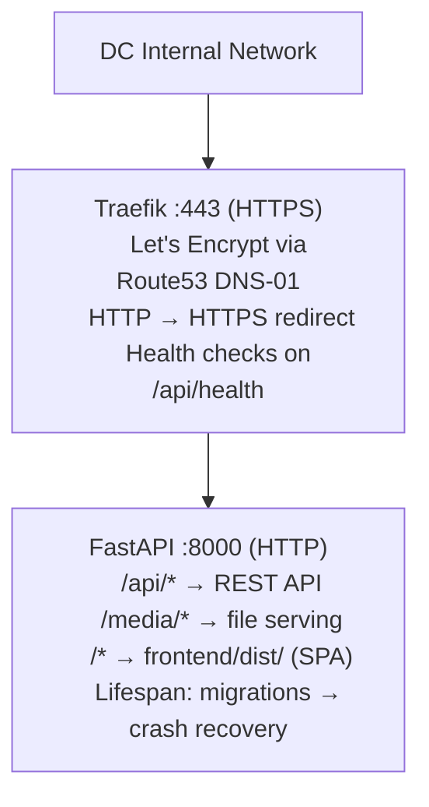

# Deployment

## Architecture

Internal data center deployment with Let's Encrypt SSL via Route53 DNS challenge.



## Quick Start

1. **Traefik** — [Setup](#traefik-setup)
2. **BrahmaHub** — [Setup](#brahmahub-setup)

## Configuration Files

| File | Target Path | Description |
|------|-------------|-------------|
| `brahmahub-api.service` | `/etc/systemd/system/` | App systemd unit |
| `traefik/traefik.service` | `/etc/systemd/system/` | Traefik systemd unit |
| `traefik/traefik.yml` | `/etc/traefik/` | Traefik static config |
| `traefik/dynamic.yml` | `/etc/traefik/` | Traefik routing rules |
| `traefik/traefik.env.example` | `/etc/traefik/traefik.env` | AWS credentials + ACME email |

## Traefik Setup

### 1. Install Traefik

```bash
TRAEFIK_VERSION=$(curl -s https://api.github.com/repos/traefik/traefik/releases/latest | jq -r .tag_name)
curl -sL "https://github.com/traefik/traefik/releases/download/${TRAEFIK_VERSION}/traefik_${TRAEFIK_VERSION}_linux_amd64.tar.gz" | tar xz
sudo mv traefik /usr/local/bin/
sudo chmod +x /usr/local/bin/traefik
traefik version
```

### 2. Create System User and Directories

```bash
sudo useradd -r -s /bin/false traefik
sudo mkdir -p /etc/traefik /var/lib/traefik /var/log/traefik
sudo chown traefik:traefik /var/lib/traefik /var/log/traefik
```

### 3. Configure

```bash
# Copy config files
sudo cp traefik/traefik.yml /etc/traefik/
sudo cp traefik/dynamic.yml /etc/traefik/
sudo cp traefik/traefik.env.example /etc/traefik/traefik.env

# Set AWS credentials and ACME email
sudo nano /etc/traefik/traefik.env

# Set domain in routing rules
sudo nano /etc/traefik/dynamic.yml    # Set Host rule to your domain

# Secure permissions
sudo chmod 600 /etc/traefik/traefik.env
sudo chown -R traefik:traefik /etc/traefik
```

### 4. AWS IAM Policy

Create an IAM user (e.g., `brahmahub_traefik`) with this policy for Route53 DNS challenge:

```json
{
  "Version": "2012-10-17",
  "Statement": [
    {
      "Effect": "Allow",
      "Action": ["route53:GetChange"],
      "Resource": "arn:aws:route53:::change/*"
    },
    {
      "Effect": "Allow",
      "Action": [
        "route53:ChangeResourceRecordSets",
        "route53:ListResourceRecordSets"
      ],
      "Resource": "arn:aws:route53:::hostedzone/<ZONE_ID>"
    },
    {
      "Effect": "Allow",
      "Action": "route53:ListHostedZonesByName",
      "Resource": "*"
    }
  ]
}
```

### 5. DNS Records

| Record | Type | Value |
|--------|------|-------|
| `brahmahub.example.com` | A | VM IP |

### 6. Start Service

```bash
sudo cp traefik/traefik.service /etc/systemd/system/
sudo systemctl daemon-reload
sudo systemctl enable --now traefik
sudo journalctl -u traefik -f
```

## BrahmaHub Setup

### 1. PostgreSQL

```bash
sudo apt update && sudo apt install -y postgresql
sudo systemctl enable --now postgresql

sudo -u postgres psql <<EOF
CREATE USER brahmahub WITH PASSWORD 'CHANGE_ME';
CREATE DATABASE brahmahub OWNER brahmahub;
GRANT ALL PRIVILEGES ON DATABASE brahmahub TO brahmahub;
\c brahmahub
GRANT ALL ON SCHEMA public TO brahmahub;
EOF
```

> **Important:** Use a strong, unique password — not the dev default from `.env.example`. Set the matching `DATABASE_URL` in `.env` (step 3).

### 2. System User

```bash
sudo useradd -r -s /bin/false -d /opt/brahmahub brahmahub
sudo mkdir -p /opt/brahmahub
sudo chown brahmahub:brahmahub /opt/brahmahub
```

### 3. Clone and Configure

```bash
sudo -u brahmahub git clone https://github.com/Metaphysic-ai/brahmahub.git /opt/brahmahub
cd /opt/brahmahub
sudo cp .env.example .env
sudo nano .env  # Set DATABASE_URL, MEDIA_ROOT_PATHS, UPDATE_REPO, GITHUB_APP_* vars
sudo chown brahmahub:brahmahub .env
```

### 4. Start Service

```bash
sudo cp deploy/brahmahub-api.service /etc/systemd/system/
sudo systemctl daemon-reload
sudo systemctl enable --now brahmahub-api
sudo journalctl -u brahmahub-api -f
```

On first start, `uv run` installs Python deps and uvicorn starts. The lifespan runs migrations automatically.

### 5. Download Frontend

The frontend is pre-built in GitHub Releases. After initial setup, the auto-update system will keep it current. For the first deployment, download manually using the `gh` CLI:

```bash
cd /opt/brahmahub
sudo -u brahmahub gh release download --repo Metaphysic-ai/brahmahub --pattern 'frontend-dist.tar.gz'
sudo -u brahmahub mkdir -p frontend/dist
sudo -u brahmahub tar -xzf frontend-dist.tar.gz -C frontend/dist
rm frontend-dist.tar.gz
sudo systemctl restart brahmahub-api
```

After this, the API serves the frontend at `/`.

### 6. Verify

```bash
# Direct backend health
curl http://localhost:8000/api/health

# Through Traefik
curl https://brahmahub.example.com/api/health

# Frontend (should return HTML)
curl https://brahmahub.example.com/

# Check certificate (may take a few minutes on first run)
curl -v https://brahmahub.example.com 2>&1 | grep "subject:"
```

## GitHub App Setup

BrahmaHub uses two GitHub Apps. Both are server-to-server (no OAuth) with auto-rotating tokens (1-hour TTL). No long-lived PATs.

| App | Purpose | Permissions | Where configured |
|-----|---------|-------------|------------------|
| `brahmahub-updater` | Production server pulls releases | Contents: **read** | Server `.env` |
| `brahmahub-release` | CI creates + auto-merges Release PRs | Contents: **read/write**, Pull requests: **read/write** | GitHub Actions vars/secrets |

They are separate to enforce least privilege — the production server key can only read, so a leak can't push code.

### `brahmahub-updater` (self-update)

### 1. Create the App

Go to the org's GitHub settings: **Organization Settings > Developer settings > GitHub Apps > New GitHub App**.

Fill in:

| Field | Value |
|-------|-------|
| Name | `brahmahub-updater` |
| Homepage URL | Any valid URL (required by GitHub, not user-facing — use the internal BrahmaHub URL) |
| Webhook | **Uncheck "Active"** (checked by default — not needed, we only poll for releases) |
| Permissions > Repository permissions > Contents | **Read-only** |
| Where can this app be installed? | **Only on this account** |

Ignore everything else (Callback URL, OAuth, Post installation, Subscribe to events). This app is strictly server-to-server — no user-facing OAuth flow.

Click **Create GitHub App**. Note the **App ID** shown on the next page.

### 2. Generate a Private Key

On the app's settings page, scroll to **Private keys > Generate a private key**. A `.pem` file downloads.

Copy it to the server:

```bash
sudo cp ~/brahmahub-updater.*.pem /opt/brahmahub/github-app.pem
sudo chown brahmahub:brahmahub /opt/brahmahub/github-app.pem
sudo chmod 600 /opt/brahmahub/github-app.pem
```

### 3. Install the App on the Repo

On the app's settings page, go to **Install App** > select the org > **Only select repositories** > pick the `brahmahub` repo.

After installing, grab the **Installation ID** from the URL:

```
https://github.com/organizations/<org>/settings/installations/12345678
                                                               ^^^^^^^^
```

### 4. Configure Environment

Add to `/opt/brahmahub/.env`:

```bash
UPDATE_REPO=Metaphysic-ai/brahmahub
GITHUB_APP_ID=123456                              # App settings > General > App ID
GITHUB_PRIVATE_KEY_PATH=/opt/brahmahub/github-app.pem
GITHUB_INSTALLATION_ID=78901234                    # From the installation URL above
# AUTO_UPDATE_INTERVAL=300                        # Optional: seconds between checks (default 300, 0 to disable)
```

Restart: `sudo systemctl restart brahmahub-api`

Check the logs for a clean startup (no GitHub App warnings):

```bash
sudo journalctl -u brahmahub-api --no-pager -n 20
```

### `brahmahub-release` (CI releases)

Follow the same creation steps as above with these differences:

**1. Create the App**

| Field | Value |
|-------|-------|
| Name | `brahmahub-release` |
| Homepage URL | Any valid URL |
| Webhook | **Uncheck "Active"** |
| Permissions > Repository permissions > Contents | **Read and write** |
| Permissions > Repository permissions > Pull requests | **Read and write** |
| Where can this app be installed? | **Only on this account** |

**2. Generate a Private Key** — same as above (download `.pem`).

**3. Install on the repo** — same as above. Note the Installation ID.

**4. Configure GitHub Actions**

In the repo (or org) settings, add:

- **Variable**: `RELEASE_APP_ID` = the App ID
- **Secret**: `RELEASE_APP_PRIVATE_KEY` = contents of the `.pem` file

Path: **Settings > Secrets and variables > Actions**

**5. Add as branch protection bypass actor**

The release app needs to merge its own PRs without manual approval. Add it as a bypass actor:

```bash
gh api repos/Metaphysic-ai/brahmahub/branches/main/protection -X PUT \
  --input - <<'EOF'
{
  "required_status_checks": {
    "strict": true,
    "contexts": ["gate"]
  },
  "enforce_admins": false,
  "required_pull_request_reviews": {
    "dismiss_stale_reviews": true,
    "require_code_owner_reviews": true,
    "required_approving_review_count": 1,
    "require_last_push_approval": true,
    "bypass_pull_request_allowances": {
      "apps": ["brahmahub-release"]
    }
  },
  "allow_force_pushes": false,
  "allow_deletions": false,
  "required_conversation_resolution": true,
  "restrictions": null
}
EOF
```

Or via UI: **Settings > Branches > main > Edit > Allow specified actors to bypass required pull requests** > add the `brahmahub-release` app.

## Updating

### Automatic (Default)

When `UPDATE_REPO` and GitHub App credentials are configured, the server automatically checks for new GitHub Releases every 5 minutes. When a new release is detected, it runs: `git checkout <tag>` → downloads `frontend-dist.tar.gz` → SIGTERM → systemd restarts → `uv run` syncs deps → lifespan runs migrations → ready.

Check the logs for auto-update activity:

```bash
sudo journalctl -u brahmahub-api | grep -i auto-update
```

### Manual

```bash
cd /opt/brahmahub
sudo -u brahmahub git fetch origin tag v0.2.0 --no-tags
sudo -u brahmahub git checkout v0.2.0
# Download frontend-dist.tar.gz as shown in step 5 above
sudo systemctl restart brahmahub-api
```

## Service Management

```bash
# Status
sudo systemctl status brahmahub-api
sudo systemctl status traefik

# Restart
sudo systemctl restart brahmahub-api
sudo systemctl restart traefik

# Logs
sudo journalctl -u brahmahub-api -f
sudo journalctl -u traefik -f
```

## Troubleshooting

### 502 Bad Gateway

```bash
# Check backend is running
curl http://127.0.0.1:8000/api/health
sudo journalctl -u brahmahub-api -f
```

### Certificate not issued

```bash
# Check ACME storage
sudo cat /var/lib/traefik/acme.json | jq .
sudo journalctl -u traefik | grep -i acme

# Verify DNS resolution
dig +short brahmahub.example.com
```

### Frontend returns 404

The SPA mount only activates when `frontend/dist/` exists. Download the frontend dist (see setup step 5).
